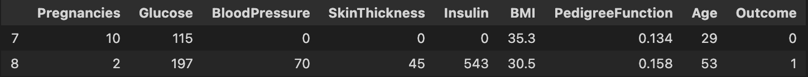
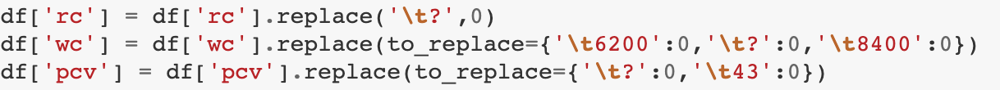
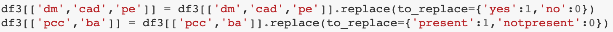
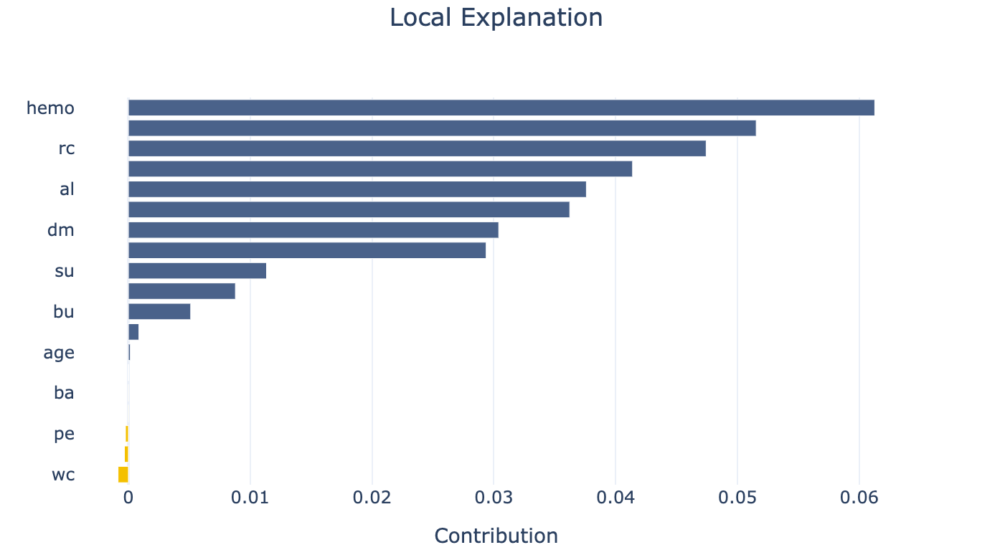

# Machine Learning in the field of Medicine

An end-to-end project that can be useful in predicting health issues realted to heart, kidney, liver etc.

## The data used is from kaggle.

### Tabular data
  
1. [Heart](https://www.kaggle.com/ronitf/heart-disease-uci): Heart Disease Dataset 
2. [Kidney](https://www.kaggle.com/mansoordaku/ckdisease): Chronic Kidney Disease
3. [Liver](https://www.kaggle.com/uciml/indian-liver-patient-records): Indian Patient Liver Records
4. [Diabetes](https://www.kaggle.com/uciml/pima-indians-diabetes-database): Pima Indian Diabetes Dataset
5. [Breast Cancer](https://www.kaggle.com/uciml/breast-cancer-wisconsin-data): Winconsin Breast Cancer Dataset
### Image data
1. [Pnemonia](https://www.kaggle.com/paultimothymooney/chest-xray-pneumonia): Chest X-Ray Images
2. [Malaria](https://www.kaggle.com/iarunava/cell-images-for-detecting-malaria): Malaria Cell Images Dataset

To know more about the data, see the aboutData.txt file. The file contains fetaures that were removed after the feature-selection part.

## Life Cycle of the Project

A data science life cycle is an iterative set of data science steps you take to deliver a project or analysis. Because every data science project and team are different, every specific data science life cycle is different.

### Feature Engineering 

Feature engineering refers to a process of selecting and transforming variables(using domain knowledge) when creating a predictive model using machine learning or statistical modeling (such as deep learning, decision trees, or regression). The process involves a combination of data analysis, applying rules of thumb, and judgement. You can read more about it [here](https://www.displayr.com/what-is-feature-engineering/).

The following summarizes the feature engineering process used in this project.
1. Data Retcification

Consider the following data-point from the diabetes dataset.



The data for the feature **BloodPressure** shows a value of 0. This value is wrong as blood pressure does not drop to 0. The different datasets might have many similar inaccuracies that could not be rectified due to lack domain knowledge.

Similarly, some datasets contained lots of typos on some of the features. For instance, in the kidney dataset, the feature ``white blood cell count(wc)`` had tab(\t) attached to the numbers. All of this was corrected seperately. 



2. Missing Values

Some of the datasets had missing values for different features. To get over the problem, the data was split based on the outcome(dependent-variable) and the feature median was used inplace of the missing values.

The data was split because the median value of features for people with and without the disease is different. They cannot be taken together.

3. Imbalanced Data

The datasets were mostly imbalanced where majority of the data showed that patients did not suffer from any disease. The ```imbalanced-learn``` library was used on the training set to balance-out the dataset after the ```train_test_split```.

4. Feature Encoding

The categorical/nominal variables present were binary. Simple ```replace()``` function was used to turn them into numeric datatype.



5. Feature Scaling

The features were scaled using the Standardization technique when training the model using the ```logistic-regression | k-neareast-neighbour``` algorithm. The datasets trained using ```random-forest-classifier```, scaling was not done.

6. Feature Selection

In datasets with large number of features, the ```information-gain``` algorithm was used to remove features with low priority. 

### Model Selection & MLOps tool used

Different algorithms were used to train the model. The performance-metrics used to evaluate the model were logged using the ```mlflow``` library. The model & hyperparameters with the best value for ```recall``` was selected. This is because, in the Health Domain, the cost associated with ```False Negative```(classifying sick patient as healthy) is high, and **recall** should be the model metric to use to select our best model when there is a high cost associated with False Negative.

The image datasets were trained using the ```fastai-resnet``` algorithm. 

Upon training the model, it was serialized as **pickle** files

### Model Deployement Framework

The ```streamlit``` framework was used to create the interface and develope the application so as to deploy it on the cloud.  


## Model Explainability
When it comes to the Health-Domain, we would also need to know why we suffer from a disease(if we do suffer from it). For instance, a diabetic patient would need to know what contributes to him being diabetic. Is it because his **glucose-levels** are high or is it because his **insulin-levels** are off the chart? 

To explain this, we can use the ```shapash``` library. The library will show us the contribution (values in range [0-1]) of each parameter in determinig if the patient is sick or healthy. 

The following is a shapash plot that shows the contribution of each feature(Y-axis) for a patient with kidney disease.

This was only implemented for kidney and cancer.



## ⏳ Installation Requirements
1. Operating system: macOS / OS X · Linux · Windows
2. Python version: Python 3.9
3. Package managers: ``pip`` | ```pipenv```

## Installation Process
Make sure your ```pip``` is up to date & install the pipenv packaging tool.

```pip install --user pipenv```

### On your terminal type the following command
```
git clone https://github.com/Roman251/LF-Major-Project.git

pipenv shell
pipenv install --skip-lock

cd app
streamlit run app.py
```

## Future Enhancements

1. With the help from a domain expert, proper feature engineering can be done. 

2. Upon prediction, based on the values of the features, a diet plan for the clients can be developed. 

## Project Created By
Roman Regmi
